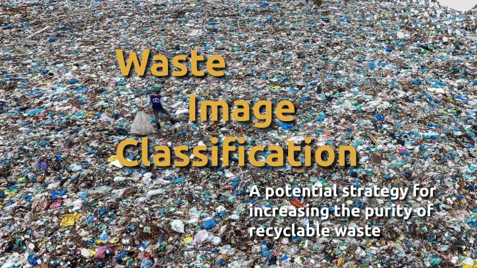
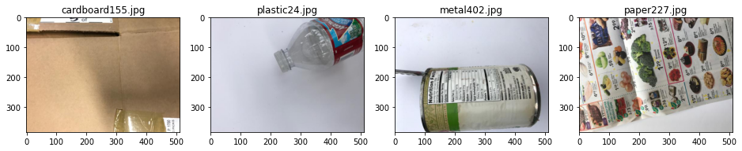
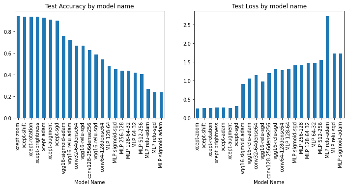
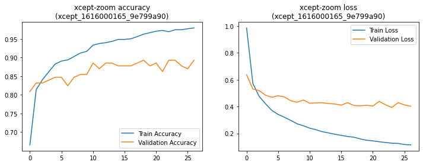
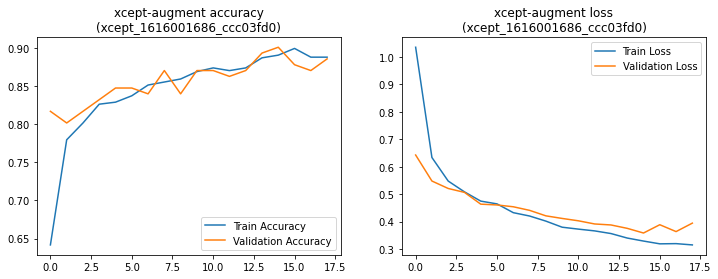
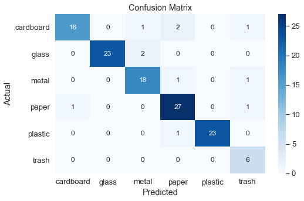
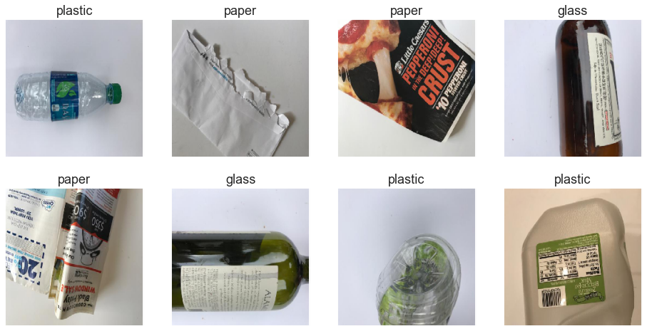
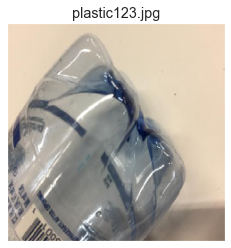
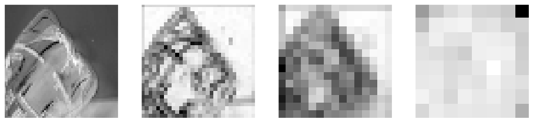

    Image from [US News](https://www.usnews.com/news/world-report/articles/2019-05-28/malaysia-to-ship-plastic-trash-back-to-the-us-other-origin-countries)

# Problem Statement
In 2017 China stopped accepting recycled material with less than 99.5% purity.  At that point many of our recyclables started making their way to South East Asia and Africa where they are dumped or burned rather than recycled causing health and environmental problems in those regions.

To solve this we need an array of strategies to increase the purity of our sorted recyclables.

The project is an exploration of using deep neural networks for classification of waste images using the Azure's python sdk and the resources of the Microsoft Azure Machine Learning Studio.

# The Data

The data for this project consists of 2272 images from research by [Mindy Yang](http://github.com/yangmindy4) and [Gary Thung](https://github.com/garythung/) for their paper [Classification of Trash for Recyclability Status](http://cs229.stanford.edu/proj2016/report/ThungYang-ClassificationOfTrashForRecyclabilityStatus-report.pdf).  The images can be downloaded in both their original size and the downsampled sizes [from this google dirve folder](https://drive.google.com/drive/folders/0B3P9oO5A3RvSUW9qTG11Ul83TEE) and are also available on [kaggle.](https://www.kaggle.com/asdasdasasdas/garbage-classification)

The images  were taken with cell phones and are all downsampled to to 512 x 384px.  The data is divided into 6 categories shown here with the number of images in each category.

For this project the 2272 images were further divided into training, validation and testing sets.

```
There are 594 paper images
There are 410 metal images
There are 403 cardboard images
There are 137 trash images
There are 501 glass images
There are 482 plastic images
```

Sample of images from the dataset:



# Azure Machine Learning Studio

In order to decrease time per model iteration and for the ability to run models in parallel I used the azureml python sdk for Azure Machine Learning Studio.

Azure was chosen for Microsoft's commitment to the environment (they have pledged to remove the equivalent of all carbon the company has emitted since it began), and their support of small nonprofits with their Nonprofit Azure Grants.

# Models

The project compares the ability of the following following models to predict the class of the images

* Multi-layer Perceptron (MLP)
* Convolutional Neural Network (CNN)
* VGG16 (pre-trained)
* Xception (pre-trained)

# Results

I tested a total of 23 models which was relatively painless due to the asynchronous nature of training them in the cloud.  The training process used early stopping with and saved the best performing model by validation accuracy.  

The test accuracy and loss from each model is displayed below.



The best performing model was the pre-trained Xception model with 99.4% accuracy on the test set.  However, this model shows signs of overfitting.

 

Fitting the same model with various image data augmentations including shift, rotation, brightness, and zoom performed slightly less well with a test accuracy of 91.1% shows fewer signs of overfitting.



This final model (xcept-augment) was chosen as the best performer.

## Confusion Matrix



## Classification Report

```
              precision    recall  f1-score   support

   cardboard       0.94      0.85      0.89        20
       glass       1.00      0.96      0.98        25
       metal       0.90      0.95      0.93        20
       paper       0.96      0.93      0.95        29
     plastic       0.96      1.00      0.98        24
       trash       0.75      1.00      0.86         6

    accuracy                           0.94       124
   macro avg       0.92      0.95      0.93       124
weighted avg       0.95      0.94      0.94       124
```

# Predictions

Below are images with their respective predictions from the model



# Visualize the Filter Maps

To try to better understand how the model goes form an image to an abstract idea we can visualize the layers of abstraction within the model.  This is an example of an original image.



Filter maps from each of the Conv2D layers within the Xception model show a progressive mode to abstraction of features.  The final images are really no longer pictures understandable by us.



# Recommendations for improvement

This project could be improved by:

* Adding more images in more contexts.  This would likely improve the ability of the model to classify images.
* Review the categories with a recycling specialist to ensure these categories are the most useful.

# Future work

* Test other methodologies including whether classifying whether an item is recyclable before classifying the recycling type.
* Test whether method of image recognition can differentiate between different kinds of plastics.
* If this does prove effective, consider releasing a phone app
* If this does prove effective, consider integrating into recycling facilities

# Conclusion

The best performing model in this set of tests was the pre-trained Xception model.  Further improvement would likely be possible by fine tuning some of the layers of the original Xception model with a very small learning rate.  Overall the 91.1% accuracy was good, but not good enough to reach the level of purity needed for recycling.

```
git Repository Structure
.
├── 1_Data_Prep_and_Azure_Setup.ipynb
├── 2_MLP_Azure.ipynb
├── 3_CNN_Azure.ipynb
├── 4_VGG16_Azure.ipynb
├── 5_Xception_Azure.ipynb
├── 7_Summary_of_Best_Model.ipynb
├── images
└── presentation_slides.pdf
```

